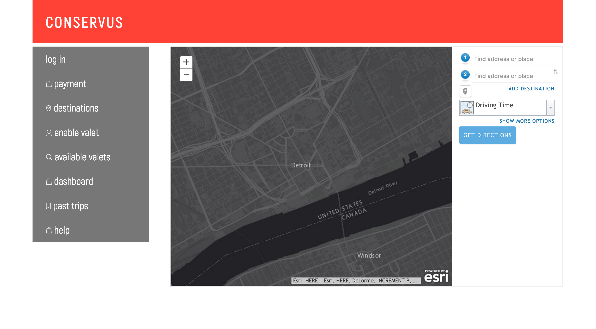

#<strike>Wattson</strike>
#<strike>Chocola</strike>
#<strike>Conservus</strike>
#<strike>Chocola</strike>
#Conservus
At your service
-----

Conservus is a congregie web app for Tesla owners and people who want to ride in a Tesla.

As an owner, you can login and enable your Tesla to be to be 'valeted', though it is in autonomous driving mode. An interested client can request a ride for a small fee and if you choose to accept them, your Tesla will navigate to their location, fulfill their request, and return to standby for the next client. You receive payment for every ride in your Tesla without having to leave to comfort of your office.

You will also have control over your Tesla's door locks, atmosphere functions, lights, trunk controls, and other miscellaneous functions.

At anytime you can chose to end the ride of a client; ending the trip and only collecting payment for the distance thus traveled.

-----

This was a submission for MHacks8.

It can be tested out [here](http://45.33.86.221:3000).
